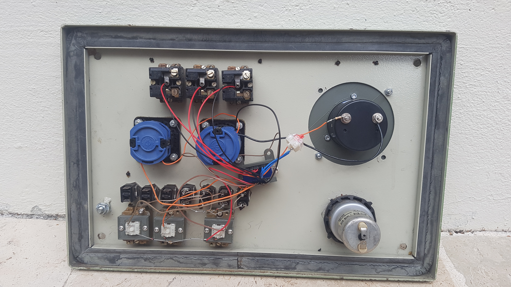

# Firmware

See the [build environment setup](https://docs.qmk.fm/#/getting_started_build_tools) and the [make instructions](https://docs.qmk.fm/#/getting_started_make_guide) for more information. Brand new to QMK? Start with our [Complete Newbs Guide](https://docs.qmk.fm/#/newbs).

## Electronic

The pinout of the Atmega can be found [here](https://i.pinimg.com/originals/a5/04/57/a504570b03287da7cdd419270ec49603.jpg).




## Import QMK firmware

```
git clone https://gitlab.com/coliss86/soumarin
git clone -b 0.17.5 https://github.com/qmk/qmk_firmware
cd qmk_firmware/keyboards
ln -s ../../sousmarin/qmk sousmarin
```

To update `qmk_firmware`
```
cd qmk_firmware
git fetch -a
git checkout <new_tag>
```

## Flash the Atmega

Make example for this keyboard (after setting up your build environment):

```
qmk compile -kb sousmarin -km default
```

Example of flashing this keyboard:

```
qmk flash -kb sousmarin -km default
```

See the [build environment setup](https://docs.qmk.fm/#/getting_started_build_tools) and the [make instructions](https://docs.qmk.fm/#/getting_started_make_guide) for more information. Brand new to QMK? Start with our [Complete Newbs Guide](https://docs.qmk.fm/#/newbs).
